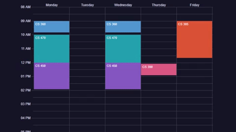

[Click Here for Demo](https://jevan1000.github.io/Course-Scheduler/)

## Installation
Everything is provided simply open "index.html" and everything should
work properly.

It's Recommended you Disable your cache inside Network settings when developing 
using google chrome. The application was developed in the chrome browser 
and untested in other browsers.

Requires the following packages: (included)
- d3.v4.min.js
- underscore-min.js
- moment.js

Note: These are included inside "includes" folder. 
